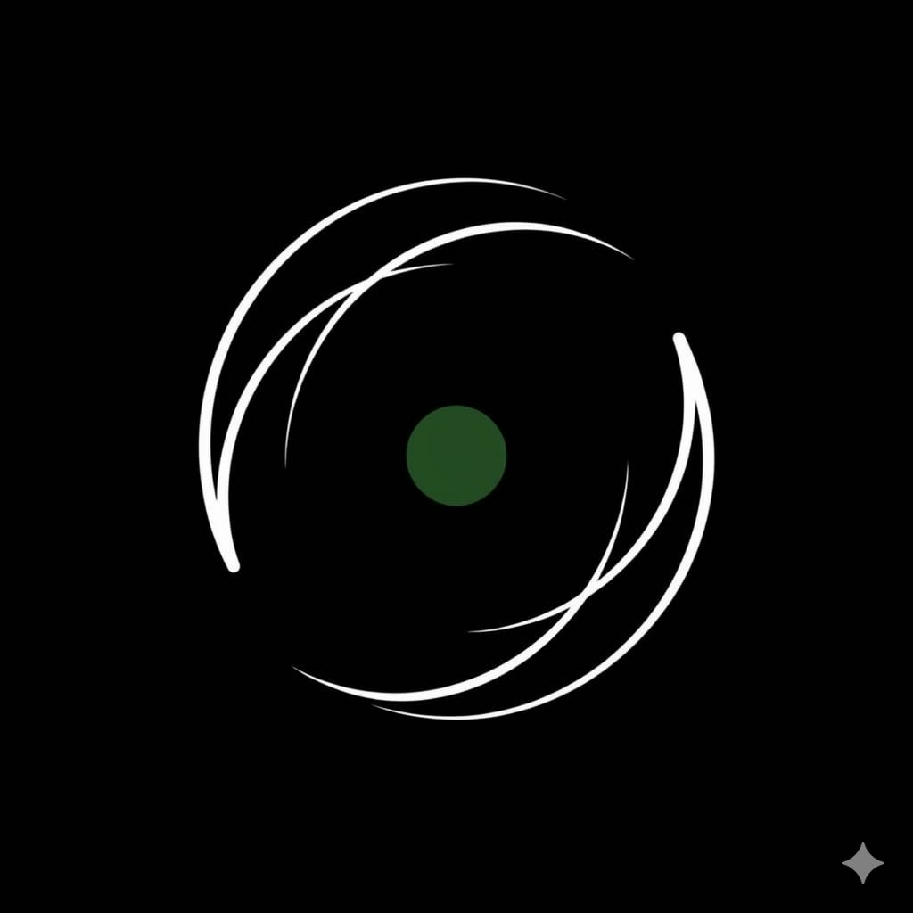

# Copter Studio

Physics-accurate drone flight simulator — RK4/BET dynamics, TF.js RL training, MAVLink HIL bridge, and Gemini-powered NLP control. Runs entirely in the browser.


**[Launch Live Demo](https://copter-studio.vercel.app)**

<p align="center">
  
</p>

> **3D drone simulator** with real-time physics, RL training panel, Aether AI chat interface, crash forensics, and benchmark dashboards — all in one browser tab. Clone and run `npm run dev` to see it in action.

## Features

- **Real-time Physics Engine** — RK4 integration, quaternion attitude, Blade Element Theory thrust, ISA atmosphere, Dryden MIL-HDBK-1797B turbulence, Cheeseman-Bennett ground effect, spring-damper ground contact with Coulomb friction, thermal updrafts
- **3D Visualization** — Three.js / React Three Fiber drone rendering with real-time telemetry overlay
- **RL Training** — TensorFlow.js inference in-browser + WebSocket Gym Bridge for Python (stable-baselines3) training
- **Aether NLP** — Natural language simulation commands powered by Gemini 2.5 Flash with local regex fallback
- **Multi-drone Support** — Bicopter, quadcopter, hexacopter, octocopter configurations
- **Robustness Testing** — Domain randomization, sensor noise (MPU-6050, BMP280, u-blox M8N), motor-out, battery sag, wind stress
- **Benchmarking** — Deterministic seeded episodes, crash forensics, policy X-Ray explainability
- **Digital Twin** — Calibration UI for matching sim parameters to real hardware
- **MAVLink HIL Bridge** — Hardware-in-the-loop integration (MAVLink v2, zero dependencies)
- **CI/CD Ready** — Headless benchmark runner with pass/fail thresholds

## Quick Start

### Prerequisites

- Node.js 18+ (LTS recommended)
- npm 9+

### Installation

```bash
git clone https://github.com/saipavantejak/copter-studio.git
cd copter-studio
npm install
```

### Development

```bash
npm run dev
```

Open [http://localhost:3000](http://localhost:3000) in your browser.

### Optional: Enable Aether AI

1. Get a Gemini API key from [Google AI Studio](https://aistudio.google.com/apikey)
2. Copy `.env.example` to `.env.local`
3. Add your key: `GEMINI_API_KEY=your_key_here`

The app works fully without Gemini — Aether falls back to the local regex parser.

## Scripts

| Command | Description |
|---|---|
| `npm run dev` | Start dev server on port 3000 |
| `npm run build` | Production build |
| `npm run preview` | Preview production build |
| `npm test` | Run tests (vitest) |
| `npm run lint` | TypeScript type-check |
| `npm run gym-bridge` | Start WebSocket bridge for Python RL training |
| `npm run hil-bridge` | Start MAVLink HIL bridge |
| `npm run ci:benchmark` | Headless CI benchmark (50 episodes) |
| `npm run ci:benchmark:strict` | Strict benchmark (100 episodes, 30% crash threshold) |

## Project Structure

```
copter-studio/
├── src/
│   ├── physics/          # Core physics (atmosphere, ground effect, sensors, prop tables)
│   ├── tabs/             # UI tab components (Simulation, Benchmark, Gym, etc.)
│   ├── context/          # React context (global app state)
│   ├── hooks/            # Custom React hooks
│   ├── workers/          # Web Workers (episode runner)
│   ├── PhysicsEngine.ts  # Main simulation engine (RK4 + BET)
│   ├── RLAgent.ts        # TensorFlow.js RL inference
│   ├── SimulationParser.ts # Aether NLP (Gemini + local fallback)
│   ├── DroneSim.tsx      # 3D drone visualization
│   └── App.tsx           # Root component
├── server/
│   ├── gymBridge.ts      # WebSocket ↔ OpenAI Gym bridge
│   └── mavlinkHILBridge.ts # MAVLink v2 HIL bridge
├── api/
│   └── gemini.ts         # Vercel serverless function (Gemini proxy)
├── scripts/
│   └── ci-benchmark.ts   # Headless CI benchmark runner
├── public/
│   ├── demo_model/       # Pre-trained demo model
│   └── swash-bicop-colab-trainer.ipynb  # Google Colab training notebook
└── vite.config.ts        # Vite + Gemini proxy plugin
```

## Deployment

### Vercel (Recommended)

1. Push to GitHub
2. Import the repo in [Vercel](https://vercel.com)
3. Add `GEMINI_API_KEY` to Environment Variables (optional)
4. Deploy — Vercel auto-detects Vite and handles the serverless function in `api/`

### Static Hosting (Netlify, GitHub Pages, etc.)

```bash
npm run build
```

Serve the `dist/` folder. Note: Aether AI requires a serverless backend for the Gemini proxy — without it, the local regex parser is used.

## RL Training with Python

1. Start the Gym Bridge: `npm run gym-bridge`
2. In Python:

```python
# See public/swash-bicop-colab-trainer.ipynb for full example
import gymnasium as gym
from stable_baselines3 import PPO

# Connect to the WebSocket gym bridge
env = gym.make("CopterStudio-v1", ws_url="ws://localhost:8765")
model = PPO("MlpPolicy", env)
model.learn(total_timesteps=100_000)
```

## Air-Gap Mode

For restricted networks without external API access:

```javascript
window.__AIRGAP_MODE = true;
```

All Gemini API calls are disabled. Aether uses the local parser exclusively.

## Tech Stack

| Layer | Technology |
|---|---|
| Frontend | React 19, TypeScript 5.8, Tailwind CSS 4 |
| 3D | Three.js, React Three Fiber, Drei |
| ML | TensorFlow.js 4.22 |
| Charts | Recharts |
| Animation | Motion (Framer Motion) |
| Build | Vite 6 |
| Test | Vitest, Testing Library |
| AI | Gemini 2.5 Flash (server-side proxy) |
| Backend | Express, WebSocket |

## License

MIT
